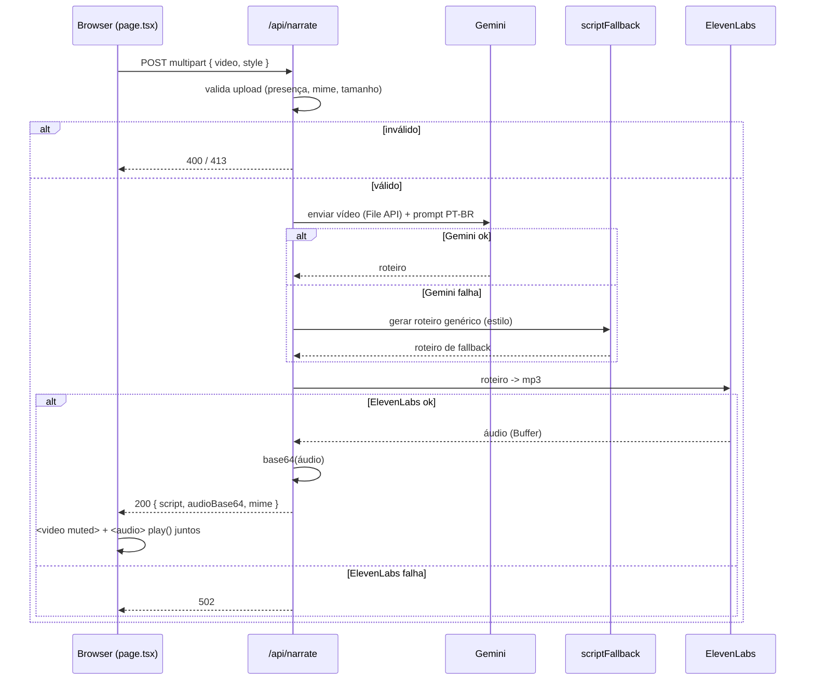

# Arquitetura — Fluxo de Dados

Ciclo de vida de uma narração, do clique ao download.

## Sequência (caminho feliz + fallback)

## Etapas no route handler

1. **Parse** do `multipart/form-data` → `video` (File) e `style` (`classic` | `hype`).
2. **Validação** ([SPEC-001](../specs/SPEC-001-video-upload.md)): sem vídeo ou mime inválido → `400`; grande demais → `413`.
3. **Roteiro** ([SPEC-002](../specs/SPEC-002-script-generation.md)): Gemini assiste ao clipe e escreve o roteiro. Falha → fallback (o fluxo **não** aborta).
4. **Áudio** ([SPEC-003](../specs/SPEC-003-text-to-speech.md)): ElevenLabs converte o roteiro em mp3. Falha → `502`.
5. **Resposta** ([SPEC-004](../specs/SPEC-004-api-narrate.md)): áudio em base64 dentro do JSON `{ script, audioBase64, mime: "audio/mpeg" }`.
6. **Playback** ([SPEC-005](../specs/SPEC-005-narration-playback.md)): o cliente reconstrói o áudio, toca junto com o vídeo mudo e oferece download.

## Observações de fluxo

- **Falha do Gemini ≠ erro para o usuário.** Vira fallback e segue em frente. Só a falha do ElevenLabs (não há áudio a entregar) resulta em `502`.
- **O vídeo não volta para o cliente pela API.** O browser já tem o arquivo local (o usuário subiu); a API só devolve roteiro + áudio. O player usa um object URL do arquivo original para o `<video>`.
- **Transporte do áudio:** base64 em JSON — simples para o MVP, com ressalva de tamanho em [ADR-0005](./decisions.md#adr-0005--áudio-como-base64-no-json).
- **Autoplay:** navegadores podem bloquear `play()` sem gesto do usuário; o `play()` deve ser disparado a partir da interação que iniciou a geração/exibição (ver SPEC-005).
